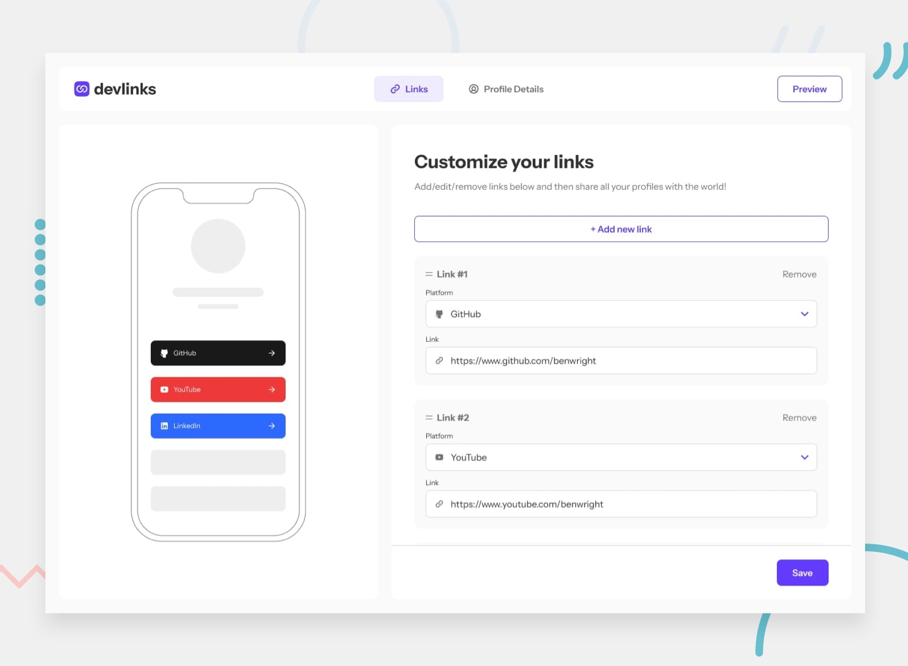

# Frontend Mentor - Link-sharing app solution

This is a full-stack solution to the [Link-sharing app challenge on Frontend Mentor](https://www.frontendmentor.io/challenges/linksharing-app-Fbt7yweGsT).

This project implements a complete link-sharing application with a modern, end-to-end F# stack, containerized with Docker, and configured with a reproducible Nix development environment. It aims to follow common best practices for development workflows, mocking, and testing, and can be a useful starting point.

## Table of contents

- [Overview](#overview)
  - [The challenge](#the-challenge)
  - [Screenshot](#screenshot)
  - [Links](#links)
- [My Process & Built With](#my-process--built-with)
- [Deployment & GitOps](#deployment--gitops)
- [Getting Started: The Development Environment](#getting-started-the-development-environment)
  - [Prerequisites](#prerequisites)
  - [Running Locally](#running-locally)
- [Development Workflow & Frontend Mocking](#development-workflow--frontend-mocking)
- [Architectural Deep Dive: A Reference for Mocking & Testing](#architectural-deep-dive-a-reference-for-mocking--testing)
  - [Core Philosophy: Contract-First Development](#core-philosophy-contract-first-development)
  - [The Mocking Strategy](#the-mocking-strategy)
  - [The Testing Strategy (TODO)](#the-testing-strategy-todo)
- [Database Migrations](#database-migrations)
- [References](#references)

## Overview

### The challenge

Users should be able to:

- Create, read, update, and delete links.
- See live previews of their links on a mobile mockup.
- Drag and drop links to reorder them.
- Add profile details like a profile picture, name, and email.
- Receive form validations for invalid URLs or missing profile details.
- Preview their devlinks profile and copy the link to their clipboard.
- View the optimal layout for the app depending on their device's screen size.
- See hover and focus states for all interactive elements.
- **Bonus**: Create an account and log in (user authentication).
- **Bonus**: Save all details to a database.

### Screenshot



### Links

- **Live Site:** (TODO)
- **Live Site (Main):** (TODO)
- **Live Site (Test):** (TODO)
- **Live Site (Production):** (TODO)

## My Process & Built With

This project is a full-stack application built entirely with F# and modern web technologies, emphasizing functional programming, type safety, and a robust development experience.

**Frontend:**

- **F#** with **Fable** to compile to JavaScript
- **Elmish** for state management (The Elm Architecture)
- **Feliz** for a declarative, type-safe React DSL
- **Vite** for a fast development server and build tool
- **Tailwind CSS** for utility-first styling
- **React** as the underlying UI library

**Backend:**

- **F#** with **ASP.NET Core**
- **Giraffe** as a lightweight, functional web framework
- **Entity Framework Core** for data access (Code-First)
- **PostgreSQL** as the relational database
- **Cookie-based Authentication** for session management
- **BCrypt.Net-Next** for secure password hashing

**DevOps & Tooling:**

- **Docker & Docker Compose** for containerization and local environment consistency.
- **Nginx** as a reverse proxy and for serving frontend static files in production.
- **Nix** to create a reproducible development environment.
- **Direnv** to automatically load the Nix shell.
- **Bun** as the frontend package manager and toolkit.
- **GitHub Actions** for Continuous Integration: image build/push to GHCR (test jobs TODO).

## Deployment & GitOps

This repository contains the application source code. All deployment configuration, including Helm charts, environment-specific values, and Kubernetes manifests, is managed in a separate **GitOps repository**.

- **GitOps Repository:** [https://github.com/wedgehov/gitops](https://github.com/wedgehov/gitops)

The deployment process follows a "Rendered Manifests" pattern, where Helm charts are pre-rendered into static YAML files. These files are the source of truth that ArgoCD uses to sync the application state to the Kubernetes cluster. This approach ensures that every change to the deployed application is version-controlled, auditable, and happens through a pull request in the `gitops` repository.

## Getting Started: The Development Environment

This project uses Nix and Docker to provide a fully reproducible development environment.

### Prerequisites

1.  **Nix Package Manager:** Nix ensures that every developer uses the exact same versions of all tools (like the .NET SDK and Bun). Follow the [official installation guide](https://nixos.org/download.html).
2.  **Direnv:** A shell extension that automatically loads the Nix environment when you enter the project directory. Please see the [official documentation](https://direnv.net/docs/hook.html) for installation instructions.
3.  **Docker & Docker Compose:** Required to run the complete application stack, including the PostgreSQL database. Install [Docker Desktop](https://www.docker.com/products/docker-desktop/).

### Running Locally

1.  Clone the repository:
    ```bash
    git clone https://github.com/your-username/link-sharing-app.git
    cd link-sharing-app
    ```

2.  Enable Direnv for the project:
    This command approves the loading of the Nix shell defined in `.envrc`. You only need to do this once.
    ```bash
    direnv allow
    ```
    Your shell will now have the correct versions of `.NET`, `bun`, etc., available.

3.  Run with Docker Compose:
    ```bash
    docker compose up --build
    ```
    Access:
    -   **Frontend:** http://localhost:5173
    -   **Backend (HTTP):** http://localhost:5199

### Local Kubernetes Development with Tilt (TODO)

For a more advanced development workflow that mirrors a production-like Kubernetes setup, a `Tiltfile` can be added. This enables a hybrid development environment:

*   **Backend:** Runs in a pod on a shared development Kubernetes cluster with hot-reloading for code changes (syncing compiled DLLs without rebuilding images).
*   **Frontend:** Runs as a local process on your machine using the Vite dev server for instant HMR.

This setup provides a high-fidelity development environment that closely matches production while maintaining a fast inner loop.

## Development Workflow & Architectural Approach

This project is built using a **Contract-First** approach. The `src/Shared` project defines the API contract (F# record types and interfaces) that acts as a source of truth for frontend-backend communication. This enables parallel development and reduces integration errors.

The frontend can be developed and tested independently of the backend using a mock API.

### Bun trust for vite-plugin-fable
If Bun prompts about untrusted scripts when installing dependencies, this repo includes a Bun config to trust the Fable Vite plugin. A normal install is enough:

```bash
bun install
```

Under the hood, `.bunfig.toml` contains:

```toml
[install]
trustedDependencies = ["vite-plugin-fable"]
```

If you prefer a one-off install without the config, you can run:

```bash
bun install --trust vite-plugin-fable
```

### Development Scripts & Modes

The client can be run in several modes to streamline development by combining different API and authentication states.

| Script (`bun run <script>`) | API Used | Authentication | Use Case |
| :--- | :--- | :--- | :--- |
| `dev` | Real API | Unauthenticated | Default mode. For working on public pages or logging in normally. |
| `dev:authed` | Real API | Authenticated | For working on protected pages against the real backend without logging in. |
| `dev:mock` | Mock API | Unauthenticated | For working on public pages against a predictable mock API. |
| `dev:mock:authed` | Mock API | Authenticated | For working on protected pages in isolation, without a running backend. |
| `dev:gallery` | Mock API | Authenticated | Runs the component dev gallery for isolated UI development. |

These scripts work by setting Vite environment variables (`VITE_USE_MOCK_API`, `VITE_START_AUTHENTICATED`, and `VITE_ENABLE_DEV_GALLERY`) when running the `vite` command.

### Component-Driven Development & The Dev Gallery

This project follows a component-driven development methodology, where the UI is built from the "bottom-up," starting with individual components. A component gallery is a best practice that facilitates this approach by providing an environment to build, view, and test UI components in isolation [2].

**Launching the Gallery**

To view the in-app component gallery, run the dedicated script from the `src/Client` directory:
```bash
bun run dev:gallery
```
Then, navigate to `/#/dev` in your browser.

**Our Lightweight Approach vs. Storybook**

While [Storybook](https://storybook.js.org/) is the powerful, industry-standard tool for building component galleries [3], it can introduce significant configuration overhead. For this project, a pragmatic, lightweight solution was chosen: an in-app gallery that lives alongside the main application code.

**Key advantages of this approach:**
*   **Simplicity:** It requires no extra dependencies or complex setup.
*   **Zero Production Cost:** The gallery is gated by the `VITE_ENABLE_DEV_GALLERY` environment variable. This ensures that the code for the gallery page and its route are completely removed from the production build via tree-shaking, having no impact on the final bundle size.

This provides the core benefits of component isolation and a living style guide without the maintenance burden of a separate toolchain, striking a good balance for the project's scale.

### Public Profile Slugs

This app uses human-readable profile slugs for public preview URLs.

- On profile creation (or when missing), the server generates a slug from first/last name, falling back to the email local-part or `user-<id>`.
- Slugs are normalized (lowercase, diacritics removed), non-alphanumeric converted to `-`, and made unique by appending an incrementing suffix (`-2`, `-3`, ...).
- Existing slugs stay stable on profile updates to avoid breaking links. If you need to support slug changes, add a redirect table and return `301` for old slugs (not implemented yet).
- The header Preview link uses the current profile slug when available.

Example URLs: `/#/preview/john-appleseed`, `/#/preview/john-appleseed-2`.

### The Testing Strategy (TODO)

*This section describes the testing plan, which is yet to be implemented.*

The goal is a comprehensive suite covering the entire application stack, from pure business logic to browser-based end-to-end flows.

**Backend Testing:**

-   **Unit Tests:** Will test business logic in `src/Server` in isolation using an in-memory database provider.
-   **Integration Tests:** Will verify API endpoints against a real PostgreSQL database spun up using Testcontainers.

**Frontend Testing:**

-   **Unit Tests:** Will test the pure Elmish `update` functions to assert correct state transitions without rendering UI.

**End-to-End (E2E) Testing:**

-   Tests will be written in F# using Playwright to simulate real user flows (login, creating links, updating profile) against a live, deployed `test` environment in the Kubernetes cluster.

**How to Run Tests (TODO):**

When implemented, all tests can be run from the root of the repository with:
```bash
dotnet test
```

## Database Migrations

This project uses EF Core for a **Code-First** approach to database management.

-   **Creating Migrations:** When you change an entity model in `src/Entity`, create a new migration by running the following command from the repository root:
    ```bash
    dotnet ef migrations add YourMigrationName --project src/Server/DbMigrations --startup-project src/Server
    ```
-   **Applying Migrations:**
    - Local (Docker Compose): The backend applies pending migrations automatically on startup (with retry) when running via `docker compose`.
    - Manual (optional during development):
      ```bash
      dotnet ef database update --project src/Server/DbMigrations --startup-project src/Server
      ```

## References

[1] Vite contributors, "Env Variables and Modes," *Vite*, [Online]. Available: https://vitejs.dev/guide/env-and-mode.html. [Accessed: Oct. 9, 2025].
[2] "Component-Driven Development," *Component Driven,* [Online]. Available: https://www.componentdriven.org/. [Accessed: Oct. 10, 2025].
[3] "Storybook: The UI component explorer," *Storybook,* [Online]. Available: https://storybook.js.org/docs/. [Accessed: Oct. 10, 2025].
